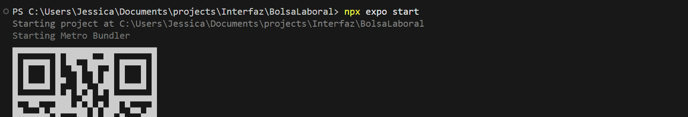

# 📱🤖 Mobile UI with Cursor AI & React Native

## 📘 About The Project  
This is a mobile application interface created using **Cursor AI** and **React Native**, The app is deployed using **Expo Go**.

## 📑 Table of Contents  
- [📘 About The Project](#-about-the-project)  
- [🚀 Getting Started](#-getting-started)  
  - [🔧 Prerequisites](#-prerequisites)  
  - [📥 Installation](#-installation)  
  - [⚙️ Running](#-running)  
- [📸 Screenshots](#-screenshots)  
- [🤝 Contributing](#-contributing)  

---
## 🚀 Getting Started

### 🔧 Prerequisites  
To run this project you need:

- [Node.js](https://nodejs.org/) >= 18  
- [Expo CLI](https://docs.expo.dev/get-started/installation/)  
- [Expo Go App](https://expo.dev/client) (on your phone, Android/iOS)  

Install Expo CLI globally:  
```bash
npm install -g expo-cli
```
## 📥 Installation 

1.- Clone the repository
```bash
git clone https://github.com/Jesdhy/Aplicativo_movil_cursor.git
```
2. Install dependencies:
```bash
npm install
```
## ⚙️ Running
To start the development server:
```bash
expo start
```
Scan the QR code using the Expo Go app on your phone to preview it live.

## 📸 Screenshots

**Design in Figma**


**Compiling the code**



**Interface designed at Expo Go**


## 🤝 Contributing
Thank you for your interest in contributing to this project! Here are some guidelines for doing so:
1. **Fork the repository** and clone the project to your local machine.
2. **Create a new branch** for your changes.
3. **Commit your changes** with a clear, descriptive message.
4. **Submit a Pull Request** with a description of your changes.

Thank you for helping improve this project!